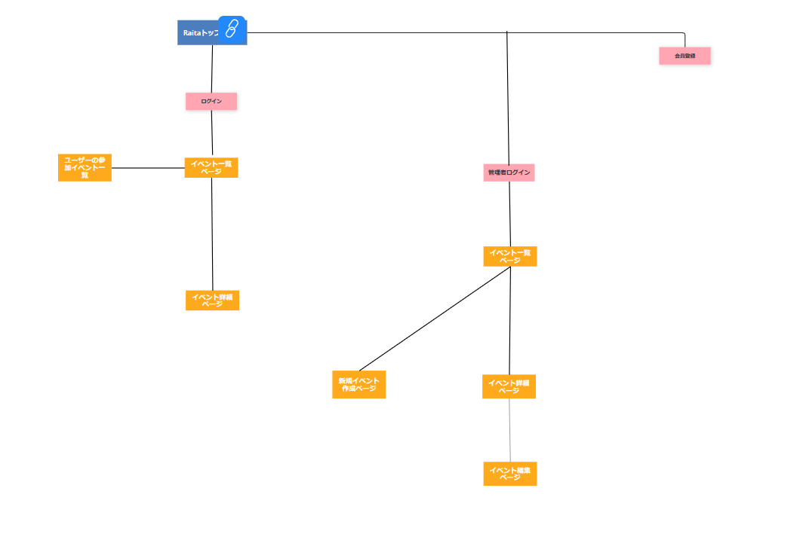
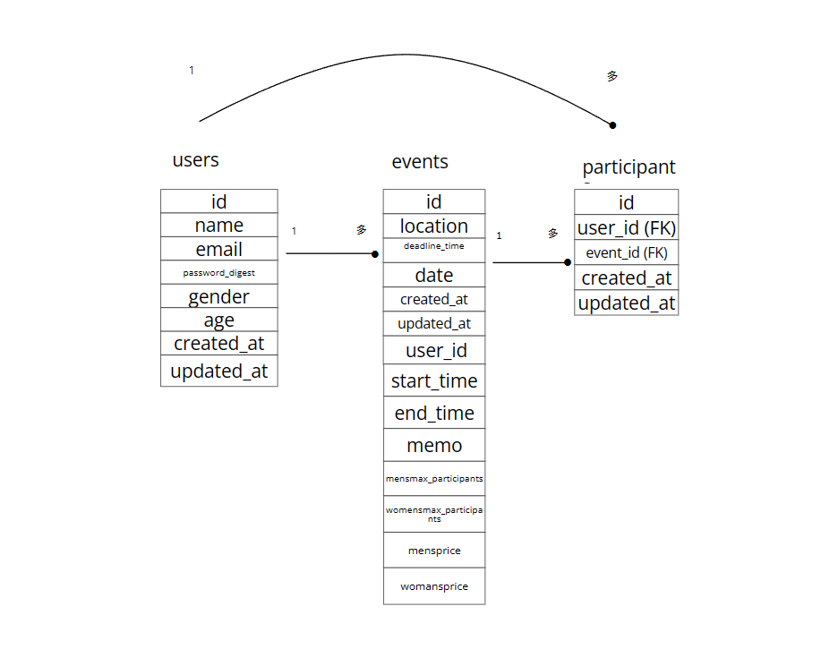

## RAITA
男女でのパーティー（イベント）を開催するアプリです。
サイト管理者である自分がイベントを作成し、そのイベントにユーザーが参加することのできるツールです。

## 概要

RAITA は以下の機能を提供しています。

## 機能

### 1. 新規会員登録機能

サイトを利用するには新規会員登録が必要です。以下の情報を入力して登録します。

- 名前（必須。５０文字以内。）
- メールアドレス（必須。２５５文字以内。メールアドレスしか受け付けない。重複するメールアドレスは受け付けない。）
- 年齢（必須。０以上の整数しか受け付けない。）
- 性別（必須。MensとWomensの二種類しか受け付けない。）
- パスワード（必須。暗号化している。）
- ID=1のユーザーを管理者と決めた。

### 2. Login/Logout 機能
- メールアドレスとパスワードでログイン。
- ログイン後のナビバーにログアウトのリンクを設置。

### 3. ユーザータイプによるリダイレクト

ユーザーIDが1のユーザーは管理者ページへ、それ以外のユーザーはユーザーページへリダイレクトされます。

### 4. イベント作成・編集・削除機能

管理者でログインすると新規イベントの登録、編集、削除ができます。以下の情報を入力して投稿できます。

- 場所（必須）
- 日付（必須）
- イベント開始時間（必須）
- イベント終了時間（必須。イベント開始時間よりも後でないといけない。）
- 男性料金（必須。０以上の整数。）
- 女性料金（必須。０以上の整数。）
- 男性最大参加人数（必須。０以上の整数。）
- 女性最大参加人数（必須。０以上の整数。）
- 申し込み締め切り時間（必須。日付よりも前でないといけない。）
- コメント（２５５文字以内）

### 5. イベント参加・参加取り消し機能

ユーザーページでは、自分の参加したいイベントを選び、参加ボタンで参加できます。ただし、定員を超えているか、締め切りを過ぎている場合は参加できない。参加の取り消しもできる。

### 6. 管理者ページのイベント参加者一覧を表示機能

管理者ページでは、各イベントに参加するユーザーの名前、性別、年齢が表示されます。

### 7. ユーザーページでの個人のイベント参加一覧表示機能

ユーザーはユーザーページから、自分が参加する予定のイベント一覧を見ることができます。

## 設計図

## Fly.io URL

https://raita-fujitaka.fly.dev/

## エピソード

実装において特に工夫した点は２つあります。
-１つ目は、ユーザーIDが１の場合は管理者ページへ。それ以外の場合はユーザーページへとルーティングを分けた点です。これによって、ユーザーIDが１である自分のみがイベントを管理することができます。
-２つ目は新規イベント作成時に「イベントの申し込み締め切り日時」よりも「イベントが開催される日時」の方が早い日時で設定して新規イベント作成しようとした場合、エラーが出るようになっています。これは、「イベント開始時刻」よりも「イベント終了時刻」を早く設定した場合も同様のエラーが起きます。これにより、イベント作成時の日時設定のミスが起きるのを防いでいます。

## 著者

藤高　亮太

